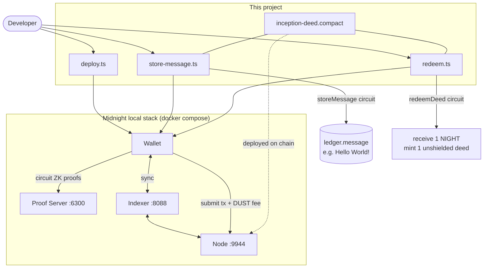

# Midnight Inception

A minimal [Midnight Network](https://midnight.network/) smart contract: **pay 1 NIGHT, receive 1 unshielded deed token**, plus a Hello World public message store.



**Hello World flow:** `storeMessage` takes a private string, discloses it on-chain, and writes the public `message` ledger. **Deed flow:** `redeemDeed` atomically pulls 1 NIGHT from the caller and mints 1 unshielded deed token to their wallet.

## Quick start

```bash
# Use nvm Node 22 (22.19+ required)
nvm install 22
nvm use 22

# Prerequisites: Docker, Compact toolchain
curl --proto '=https' --tlsv1.2 -LsSf \
  https://github.com/midnightntwrk/compact/releases/latest/download/compact-installer.sh | sh
compact update

npm install
npm run compile
npm run env:up          # first boot: proof server downloads ZK keys (several minutes)
npm run test:local
```

## CLI scripts

| Command | Description |
|---------|-------------|
| `npm run compile` | Compile `contracts/inception-deed.compact` |
| `npm run env:up` | Start local devnet (node, indexer, proof server) |
| `npm run deploy` | Deploy contract → writes `deployment.json` |
| `npm run store-message` | Store a message on-chain (default: `Hello World!`) |
| `npm run redeem` | Pay 1 NIGHT and mint 1 deed to your wallet |

## Project layout

```
contracts/inception-deed.compact   # Compact smart contract
src/deploy.ts                    # Deploy script
src/store-message.ts             # Store message circuit
src/redeem.ts                    # Redeem deed circuit
src/test/inception.test.ts       # Local integration tests
_inception/README.md             # Design notes and protocol context
```

## Design note: NIGHT vs DUST

The original inception idea referenced sending **DUST** to the contract. On Midnight, **DUST is non-transferable fee capacity** (generated from holding NIGHT). This project implements the payment as **1 NIGHT** (native unshielded token). DUST is consumed automatically when you submit transactions.

See [_inception/README.md](_inception/README.md) for full details.

## Troubleshooting

### `Wallet.Sync` during deploy

Deploy waits for wallet sync before submitting any transaction. Repeating `Wallet.Sync: [object Object]` means the wallet cannot subscribe to the **indexer** (shielded, unshielded, and DUST sub-wallets all fail).

**Fix:**

```bash
npm run env:down
npm run env:up          # wait until all 3 containers are healthy
sleep 30              # indexer may need time to catch up with the node
npm run deploy
```

**Verify services:**

```bash
docker compose ps
curl -sf http://127.0.0.1:9944/health
curl -sf -X POST http://127.0.0.1:8088/api/v4/graphql \
  -H 'content-type: application/json' -d '{"query":"{ __typename }"}'
docker compose logs --tail=50 indexer
```

The deploy script now probes node + indexer readiness before starting the wallet. Wallet sync uses `state.isSynced` (not `isStrictlyComplete`) to avoid a known DUST hang on idle local chains.

### `Custom error: 192` on redeem

```
RpcError: 1010: Invalid Transaction: Custom error: 192
```

Error **192** = `InputsSignaturesLengthMismatch` ([node error codes](https://docs.midnight.network/nodes/error-codes)). `redeemDeed` spends 1 NIGHT via `receiveUnshielded`, so the wallet must sign unshielded inputs before submit.

`balanceTx` in `src/wallet.ts` must call `signRecipe` between `balanceUnboundTransaction` and `finalizeRecipe` (matching `@midnight-ntwrk/testkit-js`).

### `Failed to connect to Proof Server` / `Transport error (POST .../prove)`

This usually means the **wallet's HTTP prover** failed to POST a large proof payload (small probe requests can still succeed).

**Fix (already applied in this repo):** the wallet uses a **local WASM prover** by default. You should see `(wallet prover: wasm)` in deploy logs.

```bash
nvm use 22
npm run env:up
npm run deploy
```

Contract circuit proofs still use the Docker proof server via `httpClientProofProvider`.

To revert to HTTP wallet proving (not recommended locally):

```bash
MIDNIGHT_WALLET_WASM_PROVER=0 npm run deploy
```

If deploy still fails:

```bash
curl -s -o /dev/null -w "%{http_code}\n" -X POST http://127.0.0.1:6300/prove -d ''
# expect 400

docker compose logs -f proof-server
```

## Documentation

- [Midnight getting started](https://docs.midnight.network/getting-started/hello-world)
- [Token transfers example](https://docs.midnight.network/examples/contracts/token-transfers)
