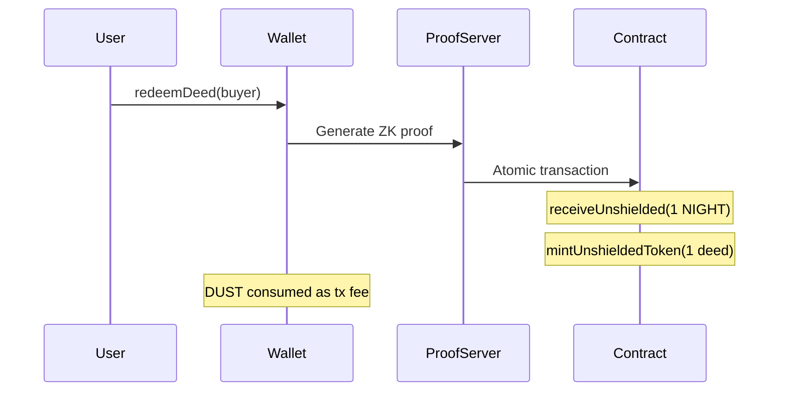

# Inception

Help to create a simplest smart contract "Hello World" storage script with 4th generation blockchain https://midnight.network/

## User story (corrected for Midnight)

**Pay 1 NIGHT → receive 1 unshielded deed token** to your wallet address.

The original note said "send 1 DUST." On Midnight:

| Token | Role |
|-------|------|
| **NIGHT** | Native capital asset; used here as the 1-unit payment into the contract |
| **DUST** | Shielded, **non-transferable** fee capacity; consumed automatically when you submit transactions — you cannot send DUST to a contract |

## Contract behavior

The [`inception-deed.compact`](../contracts/inception-deed.compact) contract provides:

1. **`storeMessage`** — Hello World public storage (private input → `disclose()` → on-chain ledger).
2. **`redeemDeed`** — Atomic circuit:
   - `receiveUnshielded` pulls **1 NIGHT** from the caller into the contract
   - `mintUnshieldedToken` mints **1 unshielded deed** to the buyer's address
   - `redeemCount` ledger counter increments



## Runbook

### Prerequisites

- [Node.js](https://nodejs.org/) 22+
- [Docker](https://www.docker.com/) (for local devnet + proof server)
- [Compact toolchain](https://docs.midnight.network/getting-started/installation):

```bash
curl --proto '=https' --tlsv1.2 -LsSf \
  https://github.com/midnightntwrk/compact/releases/latest/download/compact-installer.sh | sh
compact update
```

### Local development

```bash
yarn install
yarn compile
yarn env:up          # start node, indexer, proof server
yarn test:local      # deploy + store message + redeem (integration test)
```

### Manual CLI flow

```bash
yarn deploy
yarn store-message "Hello World!"
yarn redeem
```

`deployment.json` is written after deploy and used by the interaction scripts.

### Preview testnet (optional)

1. Start proof server: `docker compose up -d proof-server`
2. Set `MIDNIGHT_PREVIEW_SEED` or `MIDNIGHT_PREVIEW_MNEMONIC` in `.env.preview`
3. Fund wallet via [Preview faucet](https://faucet.preview.midnight.network/)
4. Run: `MIDNIGHT_NETWORK=preview yarn deploy`

## Files

| File | Purpose |
|------|---------|
| `contracts/inception-deed.compact` | Smart contract source |
| `src/deploy.ts` | Deploy to network |
| `src/store-message.ts` | Call `storeMessage` |
| `src/redeem.ts` | Call `redeemDeed` |
| `src/test/inception.test.ts` | End-to-end local tests |
